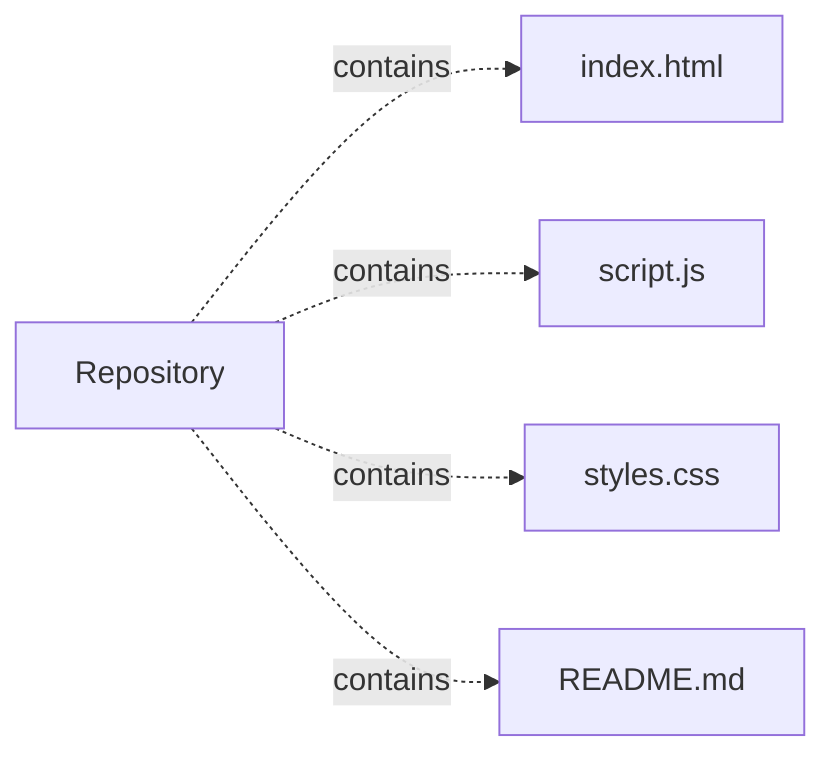

# iarsingh.github.io — project architecture

[README](README.md) · [Interview questions and answers](INTERVIEW_QA.md)

## Purpose and scope

Personal portfolio of Akhilesh Ranjan Singh — Cloud & Platform Engineer moving toward Forward Deployed and AI Platform Engineering.

This document describes files and symbols in this checkout. Deployment templates and statements in the original overview are distinguished from a verified running environment.

## Component diagram



For Python repositories, arrows show resolved local imports, not network calls or deployment order. Otherwise the diagram is a repository component map; containment arrows do not assert runtime integration.

## Components and responsibilities

| Component | Responsibility |
| --- | --- |
| [`index.html`](index.html) | Implementation or supporting configuration |
| [`script.js`](script.js) | Implementation or supporting configuration |
| [`styles.css`](styles.css) | Implementation or supporting configuration |
| [`README.md`](README.md) | Project explanations or operating notes |

## Data flow and design decisions

### What does `script.js` own

[`script.js`](script.js) defines `syncThemeLabel`, `onScroll`, `setMenu`, `setActive`, `navFor`, `check`.

Trace these definitions and imports to explain the module boundary. Relative imports identify project code; package imports should be checked against the nearest manifest.

## Setup and verification

The following commands are derived from the checked-in dependency/test contracts. Execute them from the repository root; the block prepares a local environment, not a cloud deployment.

```bash
python3 -m http.server 8000
```

No dedicated test files were found in the inspected first-party file inventory. A future implementation should add executable acceptance checks.

## Operating boundaries and design review

Before turning this checkout into a customer deployment, establish the input contract, data ownership, access controls, failure response, evaluation criteria, and rollback owner. Repository fixtures and unit tests demonstrate local behavior; they do not establish throughput, uptime, compliance, or business impact.

A useful architecture review starts with the linked implementation: identify where input enters, where a decision is made, which state can change, and which external dependency can fail. Add a deployment view only for infrastructure that is actually configured and exercised.
